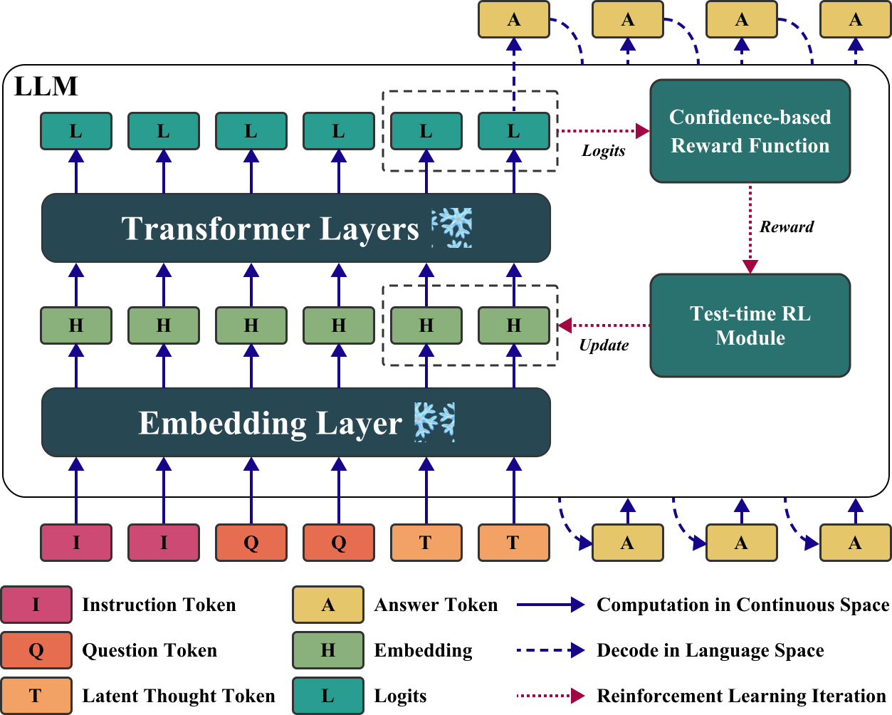

<div align="center">
  <h1>Thinking on the Fly: Test-Time Reasoning Enhancement via Latent Thought Policy Optimization</h1> 
</div>

<p align="center">
  <a href="https://arxiv.org/abs/2510.04182">
    
  </a>
</p>

## Overview

Latent Thought Policy Optimization (LTPO) is a parameter-free framework that enhances Large Language Model (LLM) reasoning entirely at test time by treating intermediate "thought" vectors as dynamic parameters rather than fixed representations . Instead of updating model weights, LTPO iteratively refines these latent vectors for each specific problem instance using an online policy gradient method guided by an intrinsic, confidence-based reward derived directly from the frozen model's own output distributions . This approach eliminates the need for external supervision or expensive text decoding during the optimization loop, enabling robust performance on challenging, out-of-distribution tasks like the AIME benchmarks where traditional latent reasoning methods often fail .



## Quick Start

### Install Dependencies

```bash
bash install.sh
```

### Evaluate LTPO

Following command will evaluate LTPO on AIME2024 benchmark using LLaMA-3.1-8B-Instruct. To evaluate different models against other benchmarks, please change the corresponding arguments.

```bash
bash scripts/run_ltpo.sh
```

The detailed responses generated by the LLM are stored in `output/logistics.pt`.

### Evaluate Zero-Shot CoT Baseline

Following command will evaluate Zero-Shot CoT baseline against all five reasoning benchmarks.

```bash
bash scripts/batch_baselines_cot.sh
```

The output logs are located in `logs` directory, prefixed with `Baseline-CoT`.

The detailed responses generated by the LLM are stored in `output/logistics.pt`.

### Evaluate Zero-Shot CoT-Unk Baseline

Following command will evaluate Zero-Shot CoT-Unk baseline against all five reasoning benchmarks.

```bash
bash scripts/batch_baselines_cot_unk.sh
```

The output logs are located in `logs` directory, prefixed with `Baseline-CoT-Unk`.

The detailed responses generated by the LLM are stored in `output/logistics.pt`.

## Acknowledgement

Our work is inspired by [LatentSeek](https://github.com/bigai-nlco/LatentSeek)
and [SoftCoT](https://github.com/xuyige/SoftCoT). Thanks for their great work!

## Citation

If you find this work helpful, please cite:

```
@inproceedings{ye2026ltpo,
  title={Thinking on the Fly: Test-Time Reasoning Enhancement via Latent Thought Policy Optimization},
  author={Wengao Ye and Yan Liang and Lianlei Shan},
  booktitle={International Conference on Learning Representations},
  year={2026},
  url={https://openreview.net/forum?id=r1WEQzkCQv}
}
```
